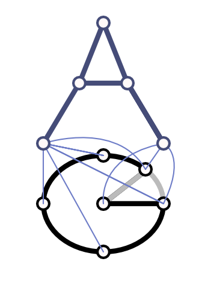

  

# abstractgraph-ml

`abstractgraph-ml` is the learning and analysis layer of the AbstractGraph
ecosystem.

It turns Abstract Graph decompositions and vectorized graph features into
estimators, neural models, feasibility checks, importance analysis, and feature
selection utilities.

For package layout, local setup, validation commands, and documentation index,
see [docs/ORGANIZATION.md](docs/ORGANIZATION.md).

## Semantic Role

`abstractgraph` defines graph representation and vectorization semantics.
`abstractgraph-ml` asks what those graph-derived representations can predict,
which structural components matter, and which graph candidates should be
accepted, rejected, ranked, or inspected.

This package answers questions such as:

- Which graph-derived features predict a property?
- Is a graph or feature set feasible for a task?
- Which subgraphs explain a fitted model?
- Which operators or hashed features should be kept for a smaller structural
  feature space?

## Main Concepts

### Estimation

The estimator layer combines an `abstractgraph` decomposition/vectorization
pipeline with downstream machine-learning estimators. It provides the main
model-facing bridge from graph semantics to prediction.

See [docs/GRAPH_ESTIMATOR.md](docs/GRAPH_ESTIMATOR.md).

### Neural Graph Models

Neural wrappers and input adapters make it possible to use Abstract Graph
features in neural workflows while preserving the structural preprocessing
stage from the core package.

### Feasibility

The feasibility layer represents admissibility constraints over graphs. It can
filter invalid graphs before training, learn coarse admissibility from observed
datasets, and reject or score generated candidates in downstream generative
workflows.

See [docs/FEASIBILITY.md](docs/FEASIBILITY.md).

### Importance

Importance utilities map model relevance back onto graph structure. They help
connect high-scoring features to concrete nodes, edges, and recurring mapped
subgraphs.

### Top-k Selection

Top-k utilities reduce large structural feature spaces and support operator or
feature selection when a smaller graph representation is needed.

## Typical Workflow

1. Define an operator program in `abstractgraph`.
2. Build a graph transformer or estimator around that decomposition.
3. Train a classical or neural model in `abstractgraph-ml`.
4. Optionally apply feasibility filtering to constrain admissible graphs.
5. Inspect salient features or subgraphs with the importance utilities.
6. Use top-k selection if a reduced structural feature space is needed.

## Ecosystem

See the [AbstractGraph ecosystem README](../../README.md) for how this
repository fits with the sibling repositories.
